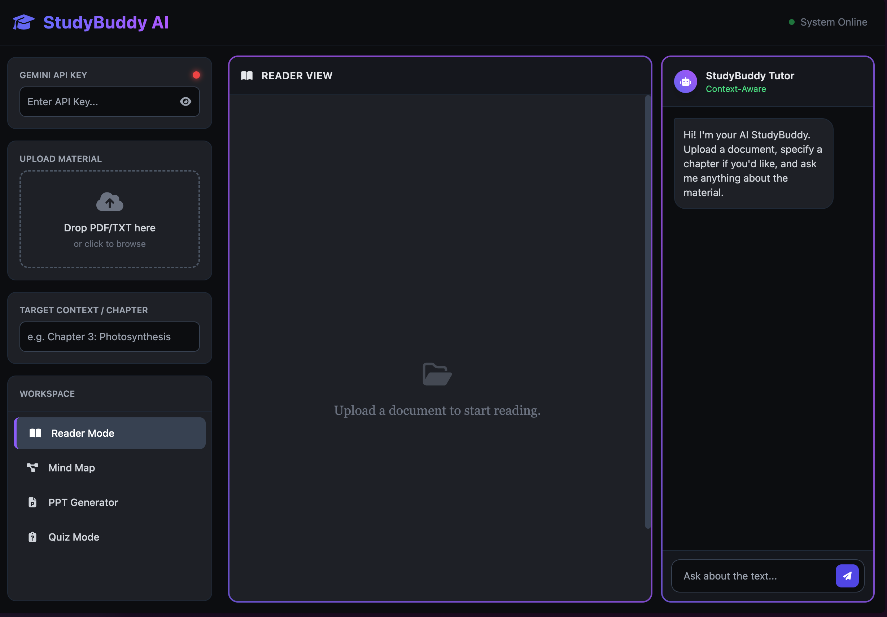
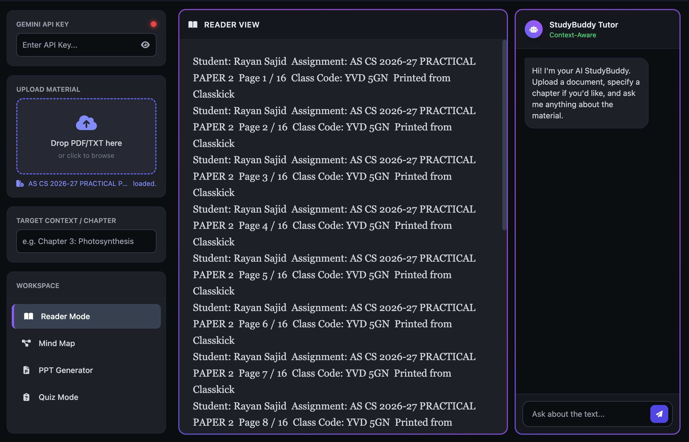
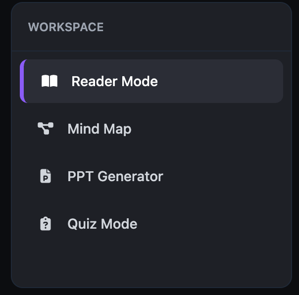
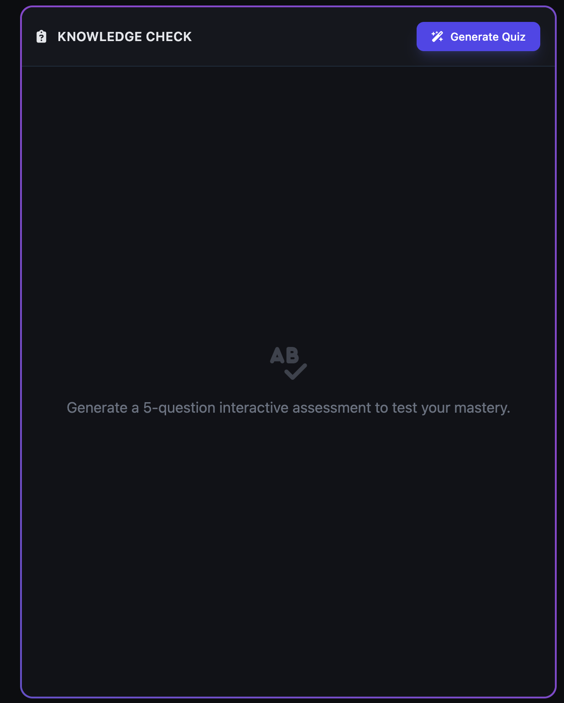

# 📚 StudyBuddy AI

> An AI-powered study companion that turns textbooks, notes, and PDFs into interactive learning tools.

🌐 **Live Demo:** https://studybuddyai-iota.vercel.app/

---

## ✨ Features

* 📄 Upload and study learning materials
* 🧠 Generate AI mind maps
* ❓ Create quizzes
* 🎴 Generate flashcards
* 📝 Summarize chapters and notes
* 💬 Ask questions about your study material
* 🔍 Explore difficult concepts with AI-powered explanations

---

## 📸 Screenshots

### Dashboard

### Study Material

### AI Tools

### Quiz / Flashcards

---

## 🛠️ Built With

* HTML
* JavaScript
* Tailwind CSS
* AI-powered learning tools
* Vercel

---

## 🎯 Purpose

StudyBuddy is designed to make revision faster by turning static study materials into interactive resources.

**Upload → Generate → Study → Understand**

---

## 👨‍💻 Author

**Rayan Sajid**

Built as an AI-powered learning project.

---

⭐ If you find StudyBuddy useful, consider starring the repository.
